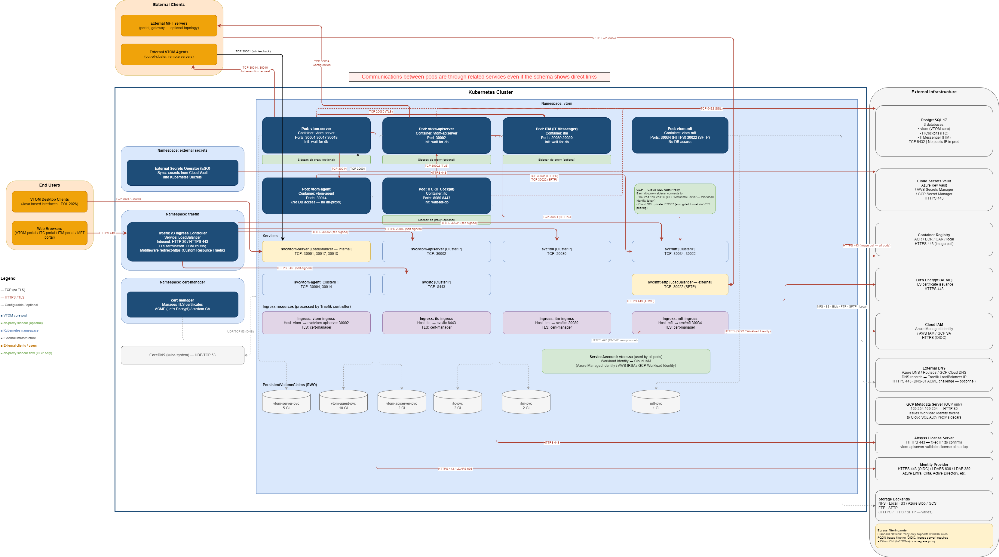

# Visual TOM — Kubernetes Helm Chart
[](LICENSE)&nbsp;
[](README-fr.md)

This repository provides a Helm chart to deploy **Visual TOM (Absyss)** and its related products on Kubernetes:

- **VTOM** — Scheduler (core)
- **ITC** — Visual TOM User Portal
- **ITM** — Visual IT Messenger
- **MFT** — Visual TOM Managed File Transfer

Validated targets:

| Environment | Status |
|---|---|
| Azure AKS | ✅ Validated |
| GCP GKE (Autopilot) | ✅ Validated |
| AWS EKS | ⚠️ Implemented, not tested in production |
| On-premise / Minikube | ✅ Tested locally |

# Disclaimer

This Helm chart is provided by Absyss SAS as a **reference deployment** of Visual TOM on Kubernetes. It is designed as a **starting point** that must be adapted by each client to match their specific infrastructure, security requirements and operational constraints (network topology, secrets management, storage classes, ingress controller, RBAC policies, etc.).

The chart is distributed **as-is**, without warranty of any kind. Absyss SAS is not liable for damages resulting from its use or from client-side adaptations.

Standard Visual TOM support contracts do not cover the Helm chart itself or client-side Kubernetes adaptations. Consulting days can be requested to assist with deployment, customization or troubleshooting.

# Prerequisites

## All environments
- **Visual TOM** ≥ 7.3.2c (earlier versions are not tested with this chart)
- **Kubernetes** ≥ 1.28
- **Helm** ≥ 3.8 (required to install from the OCI registry)
- **PostgreSQL 17** reachable from the cluster (VNet, VPC or local network)
- An **Ingress controller** installed — **Traefik** is used by default, nginx is also supported
- **cert-manager** installed with a `ClusterIssuer` configured if you use Let's Encrypt (default TLS option). Installing and configuring cert-manager is the client's responsibility — the chart only creates the `Certificate` resources. If you provide your own TLS certificates (`tls.provider: secret`), cert-manager is not required
- **ExternalDNS** (optional) — for automatic DNS record management of the LoadBalancer service. Without ExternalDNS, DNS records must be created manually. See `vtom.serverService.hostname` in the values
- A valid **VTOM license** and access to an image registry

> **Private network access / VPN:** resources such as WireGuard, Private Endpoints, Cloud SQL Auth Proxy, etc. are **not** part of this chart. They must be provisioned upstream via your IaC (Terraform, Bicep, etc.).

## Cloud-specific prerequisites

### Azure (AKS)
- ACR (Azure Container Registry) with the VTOM/ITC/ITM/MFT images loaded
- Azure Key Vault with the secrets created (see Azure section below)
- User-Assigned Managed Identity with Key Vault access (`Key Vault Secrets User`)
- External Secrets Operator installed in the cluster

### AWS (EKS)
- ECR or another registry with the images loaded
- AWS Secrets Manager with the secrets created
- IAM Role with Secrets Manager access, associated with the ServiceAccount via IRSA
- External Secrets Operator installed in the cluster

### GCP (GKE)
- Artifact Registry or GCR with the images loaded
- GCP Secret Manager with the secrets created
- GCP Service Account with Secret Manager access, linked via Workload Identity
- External Secrets Operator installed in the cluster
- Cloud SQL Auth Proxy enabled in the values (preconfigured in `values-gcp.yaml`)

### On-premise
- Local Docker registry or images loaded manually (`docker load`)
- PostgreSQL reachable from the pods
- Kubernetes secrets created manually (see on-premise section below)

# Products

The chart deploys 4 Visual TOM products, each independently toggleable via its `<product>.enabled` flag. They all share global settings (registry, namespace, database, network exposure, NetworkPolicy).

## VTOM — Scheduler

The core of Visual TOM. Three components deployed as separate pods, sharing the same image.

| Component | Role | Service | PVC | Memory (limit) |
|---|---|---|---|---|
| `vtom-server` | Scheduling engine | LoadBalancer (5 native VTOM ports) | 5 Gi | 1 Gi |
| `vtom-apiserver` | REST API + web interface | ClusterIP + HTTPS Ingress | 2 Gi | 1.5 Gi |
| `vtom-agent` | Kubernetes job executor | (none) | 10 Gi | 256 Mi |

**Typical parameters:**
- `vtom.image.tag` — VTOM version (e.g. `7.3.2c`)
- `vtom.ingress.host` — apiserver FQDN, e.g. `vtom.mycompany.com`
- `vtom.serverService.hostname` — VTOM Desktop client FQDN (managed by ExternalDNS)
- `vtom.serverService.loadBalancerIP` — static IP to survive LB reprovisioning
- `vtom.timezone` — shared timezone (default `Europe/Paris`)
- `vtom.{server,apiserver,agent}Resources` — CPU/memory per component
- `vtom.{server,apiserver,agent}Pvc.size` — storage sizes

**License:** `vtom.license.secretName` (default `vtom-license-secret`) — shared with ITC and ITM by default.

**Database:** DB named `vtom`, secret `vtom-db-secret` (keys `TOM_SGBD_USER` + `TOM_SGBD_PASSWORD` — password **VTOM-encrypted**, see [Secret formats](#secret-formats)).

**Disable:** `vtom.enabled: false` (useful if you only deploy ITC/ITM/MFT against an external VTOM server).

## ITC — Visual TOM User Portal

Web user portal to operate VTOM (visualization, monitoring, drag & drop).

| Component | Role | Service | PVC | Memory (limit) |
|---|---|---|---|---|
| `itc` | Web user portal | ClusterIP + HTTPS Ingress | 2 Gi | 1 Gi |

**Typical parameters:**
- `itc.image.tag` — ITC version (**required** if `itc.enabled=true`)
- `itc.ingress.host` — ITC FQDN, e.g. `vitc.mycompany.com`
- `itc.resources`, `itc.pvc.size`

**License:** by default reuses the VTOM license (`itc.license.secretName: vtom-license-secret`).

**Database:** DB named `ITCockpits`, secret `itc-db-secret` (keys `ITDB_USER` + `ITDB_PASSWORD` — password **plain text**).

**Disable:** `itc.enabled: false`.

## ITM — Visual IT Messenger

Messaging / notification service (email sending, alerts integrated into the VTOM workflow).

| Component | Role | Service | PVC | Memory (limit) |
|---|---|---|---|---|
| `itm` | Messenger | ClusterIP + HTTPS Ingress | 2 Gi | 1 Gi |

**Typical parameters:**
- `itm.image.tag` — ITM version (**required** if `itm.enabled=true`)
- `itm.ingress.host` — ITM FQDN, e.g. `vitm.mycompany.com`
- `itm.resources`, `itm.pvc.size`

**License:** by default reuses the VTOM license (`itm.license.secretName: vtom-license-secret`).

**Database:** DB named `ITMessenger`, secret `itm-db-secret` (keys `ITDB_USER` + `ITDB_PASSWORD` — password **plain text**).

**Disable:** `itm.enabled: false`.

## MFT — Visual TOM Managed File Transfer

Managed file transfers: inbound SFTP server + outbound connectors to external backends (NFS, S3, Azure Blob, FTP, SFTP). **No database, no separate license.**

| Component | Role | Services | PVC | Memory (limit) |
|---|---|---|---|---|
| `vtom-mft` | HTTPS portal + SFTP server | `mft` (ClusterIP) + `mft-sftp` (LoadBalancer) + HTTPS Ingress | 1 Gi | 1 Gi |

**Exposed ports:**
- `30034` — HTTPS portal (self-signed TLS served by the pod)
- `30022` — SFTP (external client access via LoadBalancer)

**Typical parameters:**
- `mft.image.tag` — MFT version (**required** if `mft.enabled=true`)
- `mft.ingress.host` — web portal FQDN, e.g. `mft.mycompany.com`
- `mft.sftpService.hostname` — SFTP FQDN (managed by ExternalDNS)
- `mft.sftpService.loadBalancerIP` — static IP of the SFTP LB
- `mft.sftpService.loadBalancerSourceRanges` — **always set in production** to restrict SFTP access by IP
- `mft.externalEgress` — egress NetworkPolicy rules to storage backends (NFS, S3, FTP, SFTP)
- `mft.pvcSeed.enabled` — init container that prepares the PVC structure on first startup

**Disable:** `mft.enabled: false`.

# Installation

## From the public OCI registry (recommended)

The chart is published as an OCI artifact on GitHub Container Registry. No authentication required.

**Step 1 — Pull the chart locally**:
```bash
helm pull oci://ghcr.io/absysslab/visual-tom --version 0.1.0 --untar
```
This downloads the chart and extracts it into a `visual-tom/` directory containing `Chart.yaml`, `values.yaml`, all `values-<cloud>.yaml`, the `values-client-template.yaml` and the `templates/`.

**Step 2 — Prepare your client values file**:
```bash
cp visual-tom/values-client-template.yaml values-mycompany.yaml
# Edit values-mycompany.yaml and fill in the lines marked "# TODO"
```

**Step 3 — Install**:
```bash
helm install visual-tom ./visual-tom \
  -f visual-tom/values-azure.yaml \
  -f values-mycompany.yaml \
  --namespace vtom --create-namespace
```

Replace `values-azure.yaml` with `values-aws.yaml`, `values-gcp.yaml` or `values-onpremise.yaml` according to your target.

> **Upgrades**: to move to a later version (e.g. 0.1.1), re-run step 1 with `--version 0.1.1`, review any changes in the `values-<cloud>.yaml`, then `helm upgrade visual-tom ./visual-tom -f ... -f values-mycompany.yaml --namespace vtom`.

## From sources

```bash
git clone https://github.com/AbsyssLab/vtom-helm.git
cd vtom-helm

helm install visual-tom ./charts/visual-tom \
  -f ./charts/visual-tom/values-azure.yaml \
  -f values-mycompany.yaml \
  --namespace vtom --create-namespace
```

# Configuration

## Values files layering

Helm merges values files in the order they appear on the command line. Each subsequent file overrides the previous one:

```
values.yaml                  (internal defaults, loaded automatically)
    +
values-<cloud>.yaml          (overrides defaults with cloud-specific values)
    +
values-mycompany.yaml        (overrides with YOUR specific values)
    =
final deployed configuration
```

## Steps

1. **Copy** `values-client-template.yaml` → `values-mycompany.yaml`
2. **Fill in** all lines marked `# TODO`
3. **Do not modify** `values.yaml` or any `values-<cloud>.yaml` file

## Network exposure

By default, **everything is private in production**. The chart enforces an internal Load Balancer for `vtom.serverService` (VTOM Desktop) and `mft.sftpService` (SFTP) via cloud-specific annotations, already configured in the `values-<cloud>.yaml` files.

| Component | Default | Override (public, tests) | Configured in |
|---|---|---|---|
| PostgreSQL | Private endpoint (Private Endpoint, Private IP, VPC peering) | Public FQDN | `database.host` — this chart |
| vtom-server (VTOM Desktop) | Internal LB — **enforced by the chart** | Public LB | `vtom.serverService.annotations` — this chart |
| MFT SFTP | Internal LB — **enforced by the chart** | Public LB | `mft.sftpService.annotations` — this chart |
| Web interfaces (Ingress) | Internal LB — **recommended on the client side** | Public LB | Ingress controller settings — **out of scope of the chart** |

**Internal LB annotations per cloud** (already configured in `values-<cloud>.yaml`):

| Cloud | Annotations |
|---|---|
| Azure | `service.beta.kubernetes.io/azure-load-balancer-internal: "true"` |
| AWS | `aws-load-balancer-scheme: "internal"` (+ `aws-load-balancer-type: "external"`, `nlb-target-type: "ip"`) |
| GCP | `networking.gke.io/load-balancer-type: "Internal"` |
| On-premise | none (no cloud LB) |

**Expose publicly (tests only)** — override the annotations in `values-mycompany.yaml`:
```yaml
vtom:
  serverService:
    annotations: {}                          # Disables the internal LB
    loadBalancerSourceRanges:
      - "203.0.113.0/24"                     # Restrict to authorized IPs
```

**Restrict access to the internal LB by IP** (production):
```yaml
vtom:
  serverService:
    loadBalancerSourceRanges:
      - "10.0.0.0/8"                         # Internal network (VNet/VPC + client VPN)
```

## Secret formats

The following conventions apply to **all infrastructures** (Azure Key Vault, AWS Secrets Manager, GCP Secret Manager, native Kubernetes secrets):

| Product | DB user | DB password |
|---|---|---|
| **VTOM** | Plain text | **VTOM-encrypted** (Absyss bcrypt) — use the encryption tool provided by Absyss |
| **ITC** | Plain text | **Plain text** (ITC does not support VTOM encryption) |
| **ITM** | Plain text | **Plain text** (ITM does not support VTOM encryption) |

> **Important:** never store the VTOM password in plain text. The expected format is the bcrypt hash generated by the Absyss tool. Conversely, ITC and ITM passwords must remain plain text — any encryption attempt will cause connection failures.

## Configuration per environment

### Azure (AKS)

**Required values:**

| Parameter | Description | Example |
|---|---|---|
| `global.imageRegistry` | ACR name | `myacr.azurecr.io` |
| `vtom.image.tag` | VTOM version | `7.3.2c` |
| `itc.image.tag` | ITC version | `7.3.2c` |
| `itm.image.tag` | ITM version | `7.3.2c` |
| `vtom.ingress.host` | VTOM domain | `vtom.mycompany.com` |
| `itc.ingress.host` | ITC domain | `vitc.mycompany.com` |
| `itm.ingress.host` | ITM domain | `vitm.mycompany.com` |
| `database.host` | PostgreSQL FQDN | `vtom-pg.postgres.database.azure.com` |
| `secrets.azure.keyVaultUrl` | Key Vault URL | `https://my-kv.vault.azure.net` |
| `secrets.azure.tenantId` | Azure AD tenant ID | `xxxxxxxx-xxxx-xxxx-xxxx-xxxxxxxxxxxx` |
| `serviceAccount.azure.clientId` | Managed Identity client ID | `yyyyyyyy-yyyy-yyyy-yyyy-yyyyyyyyyyyy` |

**Secrets to create in Azure Key Vault:**

| Secret name | Content | Format |
|---|---|---|
| `vtom-db-user` | PostgreSQL user for VTOM | Plain text |
| `vtom-db-password` | VTOM password for PostgreSQL | **VTOM-encrypted** (Absyss bcrypt) |
| `vtom-license-register` | Content of the `license.register` file | Plain text |
| `itc-db-user` | PostgreSQL user for ITC | Plain text |
| `itc-db-password` | ITC password for PostgreSQL | **Plain text** |
| `itm-db-user` | PostgreSQL user for ITM | Plain text |
| `itm-db-password` | ITM password for PostgreSQL | **Plain text** |

> **PostgreSQL — private vs public:** on Azure, prefer a **Private Endpoint** on the PostgreSQL Flexible Server (FQDN `<server>.private.postgres.database.azure.com`). The Azure public FQDN (`<server>.postgres.database.azure.com`) should only be used in test, with the PostgreSQL firewall restricted to your VNet.

### AWS (EKS)

**Required values:**

| Parameter | Description | Example |
|---|---|---|
| `global.imageRegistry` | ECR registry | `123456789.dkr.ecr.eu-west-1.amazonaws.com` |
| `vtom.image.tag` | VTOM version | `7.3.2c` |
| `itc.image.tag` | ITC version | `7.3.2c` |
| `itm.image.tag` | ITM version | `7.3.2c` |
| `vtom.ingress.host` | VTOM domain | `vtom.mycompany.com` |
| `itc.ingress.host` | ITC domain | `vitc.mycompany.com` |
| `itm.ingress.host` | ITM domain | `vitm.mycompany.com` |
| `database.host` | RDS endpoint | `vtom.xxxx.eu-west-1.rds.amazonaws.com` |
| `secrets.aws.region` | AWS region | `eu-west-1` |
| `serviceAccount.aws.roleArn` | IAM Role ARN | `arn:aws:iam::123456789012:role/vtom-role` |

**Secrets to create in AWS Secrets Manager:**

| Secret name | Content | Format |
|---|---|---|
| `vtom/db-user` | PostgreSQL user for VTOM | Plain text |
| `vtom/db-password` | VTOM password | **VTOM-encrypted** |
| `vtom/license-register` | `license.register` file | Plain text |
| `vtom/itc-db-user` | PostgreSQL user for ITC | Plain text |
| `vtom/itc-db-password` | ITC password | **Plain text** |
| `vtom/itm-db-user` | PostgreSQL user for ITM | Plain text |
| `vtom/itm-db-password` | ITM password | **Plain text** |

### GCP (GKE)

**Required values:**

| Parameter | Description | Example |
|---|---|---|
| `global.imageRegistry` | Artifact Registry | `europe-west1-docker.pkg.dev/my-project/vtom` |
| `vtom.image.tag` | VTOM version | `7.3.2c` |
| `itc.image.tag` | ITC version | `7.3.2c` |
| `itm.image.tag` | ITM version | `7.3.2c` |
| `vtom.ingress.host` | VTOM domain | `vtom.mycompany.com` |
| `itc.ingress.host` | ITC domain | `vitc.mycompany.com` |
| `itm.ingress.host` | ITM domain | `vitm.mycompany.com` |
| `dbProxy.cloudsqlProxy.instanceConnectionName` | Cloud SQL instance | `my-project:europe-west1:vtom-postgres` |
| `secrets.gcp.projectId` | GCP project ID | `my-gcp-project` |
| `serviceAccount.gcp.serviceAccount` | GSA linked to the KSA | `vtom@my-project.iam.gserviceaccount.com` |

**Secrets to create in GCP Secret Manager:**

| Secret name | Content | Format |
|---|---|---|
| `vtom-db-user` | PostgreSQL user for VTOM | Plain text |
| `vtom-db-password` | VTOM password | **VTOM-encrypted** |
| `vtom-license-register` | `license.register` file | Plain text |
| `itc-db-user` | PostgreSQL user for ITC | Plain text |
| `itc-db-password` | ITC password | **Plain text** |
| `itm-db-user` | PostgreSQL user for ITM | Plain text |
| `itm-db-password` | ITM password | **Plain text** |

### On-premise / RKE2 / Minikube

**Required values:**

| Parameter | Description | Example |
|---|---|---|
| `global.imageRegistry` | Local registry | `registry.mycompany.com` |
| `vtom.image.tag` | VTOM version | `7.3.2c` |
| `itc.image.tag` | ITC version | `7.3.2c` |
| `itm.image.tag` | ITM version | `7.3.2c` |
| `vtom.ingress.host` | VTOM domain | `vtom.mycompany.local` |
| `itc.ingress.host` | ITC domain | `vitc.mycompany.local` |
| `itm.ingress.host` | ITM domain | `vitm.mycompany.local` |
| `database.host` | PostgreSQL hostname/IP | `192.168.1.50` |

**Kubernetes secrets to create manually before deployment:**

```bash
kubectl create namespace vtom

# VTOM user + password (password VTOM-ENCRYPTED — Absyss bcrypt)
kubectl create secret generic vtom-db-secret \
  --from-literal=TOM_SGBD_USER='<postgresql-user>' \
  --from-literal=TOM_SGBD_PASSWORD='<vtom-encrypted-password>' \
  -n vtom

# VTOM/ITC/ITM license (file provided by Absyss)
kubectl create secret generic vtom-license-secret \
  --from-file=license.register=/path/to/license.register \
  -n vtom

# ITC user + password — PLAIN TEXT
kubectl create secret generic itc-db-secret \
  --from-literal=ITDB_USER='<postgresql-user>' \
  --from-literal=ITDB_PASSWORD='<plain-text-password>' \
  -n vtom

# ITM user + password — PLAIN TEXT
kubectl create secret generic itm-db-secret \
  --from-literal=ITDB_USER='<postgresql-user>' \
  --from-literal=ITDB_PASSWORD='<plain-text-password>' \
  -n vtom
```

## NetworkPolicy — Load Balancer health checks

For cloud Load Balancers to be able to probe pod health, the source CIDRs of the probes must be explicitly allowed in the NetworkPolicy. Configure `networkPolicy.lbHealthCheckCidrs` according to your cloud:

| Cloud | Recommended value |
|---|---|
| Azure | `["168.63.129.16/32"]` |
| AWS | VPC CIDR (e.g. `["172.31.0.0/16"]`) — do **not** use `["0.0.0.0/0"]` in production |
| GCP | `["130.211.0.0/22", "35.191.0.0/16"]` (Internal LB uses both ranges) |
| On-premise | `[]` (no cloud probe) |

The `values-<cloud>.yaml` files already provide the correct default value.

# Architecture



# Upgrade

```bash
# Via OCI
helm upgrade visual-tom oci://ghcr.io/absysslab/visual-tom \
  --version 0.1.1 \
  -f values-azure.yaml \
  -f values-mycompany.yaml \
  --namespace vtom

# From sources
helm upgrade visual-tom ./charts/visual-tom \
  -f ./charts/visual-tom/values-azure.yaml \
  -f values-mycompany.yaml \
  --namespace vtom
```

# Uninstallation

```bash
helm uninstall visual-tom -n vtom
```

By default, **PersistentVolumeClaims (PVCs) and the underlying PersistentVolumes (PVs) are retained** (`reclaimPolicy: Retain`). This protects your data (encryption keys, application logs, audit logs, configuration) against accidental deletion.

> ⚠️ **WARNING — Irreversible data loss**
>
> The commands below permanently delete **all VTOM, ITC, ITM and MFT data**. On Azure / AWS / GCP, the underlying cloud disk is also deleted. **No restoration is possible without a prior backup**.
>
> Only run after you have:
> - Taken a complete PostgreSQL dump
> - Backed up the configuration files and logs from the PVCs
> - Confirmed that this data is no longer needed

```bash
# 1. Delete the PVCs (releases the PVs, which transition to "Released" state)
kubectl delete pvc --all -n vtom

# 2. Delete the released PVs (permanent loss of the underlying disks)
kubectl get pv | grep "vtom/" | awk '{print $1}' | xargs -r kubectl delete pv

# 3. (Optional) Delete the namespace
kubectl delete namespace vtom
```

# Verifying the deployment

```bash
kubectl get pods -n vtom
kubectl get ingress -n vtom
kubectl get svc -n vtom
helm status visual-tom -n vtom
```

# Troubleshooting

**Pods stay in `Pending`:**
```bash
kubectl describe pod <pod-name> -n vtom
# Check the events — typically a PVC issue or insufficient resources
```

**Pods stay in `Init:0/1` or `Init:Error`:**
```bash
kubectl logs <pod-name> -n vtom -c wait-for-db
# The DB proxy is not starting or the DB is unreachable
```

**ESO secrets are not syncing:**
```bash
kubectl get externalsecret -n vtom
kubectl describe externalsecret vtom-db-secret -n vtom
# Check the permissions of the Managed Identity / IAM Role / GSA on the secret store
```

**The TLS certificate is not being issued:**
```bash
kubectl get certificate -n vtom
kubectl describe certificate vtom-tls-cert -n vtom
# Check that the ClusterIssuer is ready and the domain is reachable from the internet
```

**The Load Balancer stays `<pending>` or probes are failing:**
```bash
kubectl describe svc vtom-server -n vtom
# NetworkPolicy side: check networkPolicy.lbHealthCheckCidrs (see dedicated section)
# Cloud side: check annotations and LB quotas
```

# License

This project is licensed under the Apache 2.0 License — see the [LICENSE](LICENSE) file for details.
